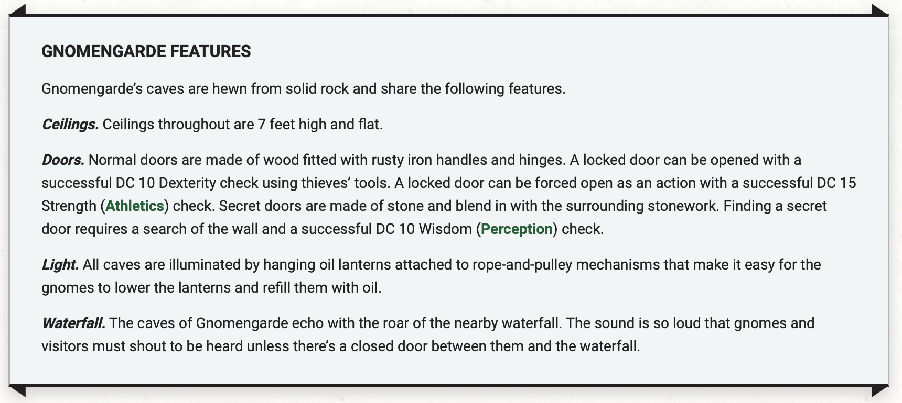
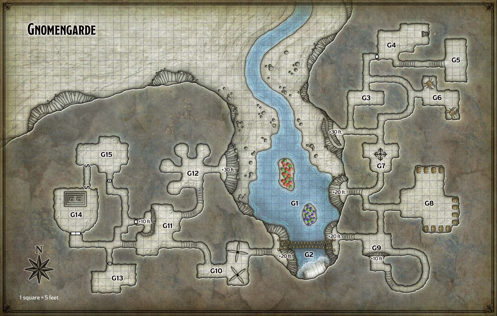

# Gnomenguard

## Prep needed:

Physical bits:
- 13 Barrels
- 1 Barrel Mimic
- MAYBE: 2 Barrel crabs
- MAYBE: 20-8 Rock gnomes (8 are sleeping)
    - Only need enough for one room at a time
- MAYBE: Autoloading crossbow
- Print painting
- Make a character version of the map

Planning bits:
- More puzzles?
- Tie this quest into excavation and 1 other

Goals prep:
- Print out cards for the Treasure Hunt options
- Print out cards for the Bolognese win
- Plan out possible NPCs to be the one who cooks/serves the Bolognese win

Ideas:
- Make 2 crowns for the kings, and thats all we need to distinguish them from the others, and they can use the same figures
- Establish that every rock gnome recluse born in this clan has piercing green eyes
- Maybe Facktoré is like an "ally" that you can "recruit". She is an artificer with a huge autoloading crossbow, which maybe could come in handy against a dragon!
- Facktoré's estranged brother Untoré is a candidate for Father's Killer, but he is only seen at Gnomenguard after the first visit. If you recruit Facktoré, then she will tell you to come back in the future

## Actual Quest

### Surrounding Lore

### Backstory

The caves of Gnomengarde are carved into the base of a mountain southeast of Phandalin, around a narrow waterfall. The rock gnome wizards who occupy these caves form strategic alliances with their human and dwarf neighbors as needs warrant. Reclusive and secretive, the gnomes craft minor magic items and useful, nonmagical inventions to pass the time. In these endeavors, their failures outnumber their successes. They seldom stray far from home, subsisting largely on the mushrooms that grow on misty islands outside their caves.

*Additional context:* The mushrooms give them all a distinctive piercing green eye color and a diminuitive size. It's rumored that the mushroom diet may also cause psychosis, though nothing substantial has come of that claim. There have been a few members in recent history who have been exiled from the reclusive clan.

Gnomengarde has two married kings who rule in tandem — [Gnerkli](../../npc_content/all_npcs.md#gnerkli) and [Korboz](../../npc_content/all_npcs.md#korboz). Korboz recently lost his mind and is keeping Gnerkli as his prisoner. Their subjects don’t understand the nature of Korboz’s affliction, and are at a loss as to what to do. They wish no harm to befall either king, but they acknowledge that Korboz has become a danger to himself and others.

In addition to the danger posed by the mad king, two gnomes have mysteriously vanished within the last tenday. No one except King Korboz knows that a shapechanging monster (a mimic) has crept into Gnomengarde and is feeding on the gnomes, changing its appearance as it makes its way through the complex. Korboz was attacked and almost killed by the creature, with that event inspiring his madness. He has sequestered himself and his beloved Gnerkli in their quarters because he doesn’t want the monstrous shapechanger to devour them. Korboz hopes the creature will tire of eating gnomes and leave. Providing Korboz with evidence of the mimic’s demise restores his sanity.

To completem the quest, the characters must obtain at least one magic item from the gnomes. Of all the items they can secure, only the [Hat of Wizardry](../../npc_content/magic_items.md#hat-of-wizardry) interests [Harbin Wester](../../npc_content/all_npcs.md#harbin-wester), who will offer to buy it for 50 gp. There are total four magic items that the adventurers can amass: the Hat of Wizardry (from Korboz), a [Wand of Pyrotechnics](../../npc_content/magic_items.md#wand-of-pyrotechnics) (from Gnerkli), a [Clockwork Amulet](../../npc_content/magic_items.md#clockwork-amulet) and [Pole of Collapsing](../../npc_content/magic_items.md#pole-of-collapsing) (from the group of gnomes, given by Fibblestib and Dabbledob).

### Wild Magic

Wild magic is a kind of magic that can’t be controlled, and Gnomengarde has long been a source of it. When a creature anywhere on the Gnomengarde map expends a spell slot to cast a spell of 1st level or higher, an additional effect might occur. Roll a d20 and consult the following table to determine the effect, if any. This wild magic effect lasts for 1 hour, or until ended with a ***remove curse*** spell or similar magic.

| d20   | Wild Magic Effect |
| ------ | ----------------- |
| 1-6 | None |
| 7-10 | The caster’s skin turns a vibrant shade of blue |
| 11-14 | Tiny, insubstantial motes of light circle the caster, shedding bright light in a 10-foot radius and dim light for an additional 10 feet. |
| 15-17 | The caster sprouts wings like those of a butterfly. The wings give the caster a flying speed of 30 feet. |
| 18-19 | The caster teleports up to 60 feet to a random unoccupied space of the DM’s choice. |
| 20 | Random whimsical effect of the DM's choice |

### Locations and Events

The players arrive into area G1 on the eastern side, and have the choice of going into either G3 or G7.

#### G1 - Misty Pool and Mushroom Islands

The gnomes subsist on 2-foot-tall mushrooms that grow atop two small islands in the middle of this 3-foot-deep pool. The islands are perpetually shrouded in mist from the waterfall. Magic bestowed upon the islands by Gnomengarde’s first settlers causes the mushrooms to grow to abnormally large size. This same magic is the source of Gnomengarde’s wild magic (see above).

The mushrooms come in three colors. Red mushrooms provide oil that the gnomes use to fuel their lanterns and other mechanical devices. Green mushrooms are ground into flour and used to make a tasty green bread. They give the gnomes their distinctive green eyes and diminuitive size. Purple mushrooms are crushed and fermented to make mushroom wine, which tastes as good as it sounds. These are rumored to be the cause of the psychosis.

#### G2 - Waterfall and Rope Bridge

The waterfall plunges 60 feet, its mist lightly obscuring a 35-foot-long rope bridge firmly anchored to 20-foot-high ledges. The bridge is difficult terrain, and sags so that its midpoint is only 15 feet above the water. A creature that falls or jumps from the bridge takes no damage if it lands in the water, which is 5 feet deep in the area below the bridge. The bridge has AC 11, 30 hit points, and immunity to poison and psychic damage. The barrel crab contraptions in area G6 are too clumsy to cross the bridge without getting tangled in its ropes. This bridges [G9, the guard area](#g9---gnome-guard-post) and [G10, the spinning blades](#g10--spinning-blades)

#### G3 - Dining Room

This room contains several dining tables and chairs sized for Small folk. A stout wooden cabinet against the east wall holds tin dishware and utensils.

> The air smells like fresh dirst and pungeant spores. It reminds you of the purposefully molded cheese that is sold in fancy nobleman epicuries. Besides the smell, you also feel the slight buzzing of wild magic, which has an energetic and exciting aura.

#### G4 - Kitchen 

This kitchen is furnished with gnomes in mind, so everything is either close to the floor or readily reachable by tugging on an overly complicated rope-and-pulley mechanism. Five rock gnome recluses busy themselves here:

> FIve rock gnome recluses busy themselves in the kitchen. They are non-hostile and almost entirely absorbed in their work. They likely have time for a quick chat.

- Joybell (female) uses a poker to stoke the fire of a hot iron stove standing against the east wall.
- Dimble (male) uses a complicated press-like contraption to squeeze oil out of a big red mushroom and filter the liquid into four oil flasks.
- Panana (female) stands atop a low table and uses a mechanical rolling pin contraption to kneed green bread dough. The severed caps of several big green mushrooms are set around her.
- Uppendown (male) forms the dough into loaves of green bread, his tongue sticking out as he carefully shapes each loaf like a master sculptor.
- Tervaround (female) teeters on a stool as she stuffs a big purple mushroom into a barrel, so that it can ferment and be turned into mushroom wine.

Characters who question the gnomes are urged to speak to Fibblestib or Dabbledob in the workshop (area G11), as they know more about what’s going on than any other gnomes in the complex. These gnomes won’t leave the kitchen, but they can point characters in the right direction. The gnomes avoid talking about the missing gnomes or Mad King Korboz.

#### G5 - Pantry

This room is piled high with small wooden crates. Each contains loaves of green mushroom bread and other foodstuffs collected and kept by the gnomes.

#### G6 - Barrel Crab Room

Parked in alcoves in this otherwise empty room are two gnomish contraptions. Each resembles a crab with a barrel for a shell, six articulated metal legs, and a pair of forward-facing pincer claws. A hatch on the top of each barrel opens to reveal an interior compartment equipped with a small, leather-padded seat surrounded by levers, pedals, and gears. The barrels are not airtight.

The gnomes built these crablike contraptions to grip and move other objects, rather like crude forklifts. However, the contraptions are so clumsy that they are useless for delicate work. They are just small enough to navigate Gnomengarde’s 5-foot-wide passageways.

Each barrel crab is a Large object with AC 15, 30 hit points, a Strength score of 10, and immunity to poison and psychic damage. It is designed to hold a single Small humanoid, though a Medium humanoid can fit inside with some discomfort. While in the barrel with the hatch closed, a creature has total cover against attacks from outside the contraption. It can use its action to make the contraption scuttle across the ground at a walking speed of 15 feet or make one attack with its pincer claws.

**Claws:** Melee Weapon Attack: +2 to hit, reach 5 ft., one target. Hit: 5 (2d4) piercing damage, and the target is grappled (escape DC 10).

#### G7 - Autoloading Crossbow Platform

Bolted to the floor of this room is a rotating platform equipped with four heavy crossbows that reload automatically. Each crossbow comes with twenty bolts. Mounted above the crossbows at a height of 6 feet is a chair equipped with pedals that causes the entire contraption to spin counterclockwise, and with levers that reload and fire the crossbows. This clanking, clattering contraption is a Large object with AC 13, 45 hit points, and immunity to poison and psychic damage. Every time it loses 10 hit points, one of its crossbows breaks.

A creature sitting in the chair can use an action to rotate the device up to 360 degrees counterclockwise and fire up to two of its crossbows in any direction. Each crossbow makes the following attack.

**Heavy Crossbow** Ranged Weapon Attack: +5 to hit, range 50/200 ft., one target. Hit: 5 (1d10) piercing damage.

Sitting in the chair when the adventurers enter is the device's inventor: [Facktoré](../../npc_content/all_npcs.md#facktoré). When she sees the adventurers enter, she exclaims:

> Perfect, targets!

She only stands down when the crossbows cease to function or when she can no longer sees the adventurers. When that happens, she yells out:

> Thank you!

#### G8 - Mimic and Mushroom Wine

This room contains twelve forty-gallon barrels set into wide alcoves. Each barrel is secured by a wooden brace. Nine of the barrels are on ground level and accessible by adventurers. One is on the south wall, and four each on the north and east walls. Of the north and east barrels, one of them is the mimic. Roll a d8 (1-4 is on the north wall, left to right; 5-8 is on the east wall, top to bottom).

If the players assume the mimic is here, and attempt to guess and choose the wrong wall, the mimic attacks with surprise. If the players enter and leave, the mimic attacks with surprise on the way out. If the players destroy all the barrels, the gnomes will be very mad at them.

#### G9 - Gnome Guard Post

Mist from the waterfall dampens this empty cave, which has a 10-foot-high ledge overlooking it to the south. The ledge can be reached by following the curved tunnel to the east, or by scaling the slick rock wall with a successful DC 12 Strength (Athletics) check.

Two rock gnome recluses stand on the ledge — a female named Ulla and a male named Pog. When anyone enters the cave, Ulla calls out, “Who goes there?” in Gnomish, then Pog repeats the question in Common. Their orders are to “attack shapechangers on sight.” Since anyone might be a shapechanger, they attack anyone who can’t prove they are who they claim to be. Characters who don’t want to be attacked must succeed on one of the following checks:

- A DC 10 Charisma (Deception) check to trick the gnomes into thinking the characters have an audience with the kings of Gnomengarde.
- A DC 10 Charisma (Intimidation) check to scare the gnomes into thinking that any harm visited upon the characters will result in Gnomengarde’s destruction.
- A DC 10 Charisma (Persuasion) check to convince the gnomes that the characters can’t be shapechangers, as shapechangers would surely take less conspicuous forms.

(they would then cross [the bridge](#g2---waterfall-and-rope-bridge))

#### G10 - Spinning Blades

This area is lightly obscured by mist from the waterfall. The larger eastern part of the room contains two rapidly spinning devices that look like turnstiles fitted with stacks of long, sharp blades spaced 1 foot apart. The northern turnstile spins counterclockwise, while the southern one spins clockwise. Any creature that enters or starts its turn in the eastern part of the room while the blades are spinning must make a DC 15 Dexterity saving throw, taking 18 (4d8) slashing damage on a failed save, or half as much damage on a successful one.

Set into the south wall of the smaller western part of the room is a brass lever in the down position. Pulling the lever up causes the turnstiles to stop spinning, allowing safe passage through the chamber. The rock gnomes bypass this trap by using the mage hand cantrip to move the lever from the east doorway.

#### G11 - Inventor's Workshop

As the characters approach this area, they overhear an argument in Gnomish between two rock gnome recluses — a male named [Fibblestib](../../npc_content/all_npcs.md#fibblestib) and a female named [Dabbledob](../../npc_content/all_npcs.md#dabbledob). As Gnomengarde’s foremost inventors, they are trying to dream up an invention that will cure King Korboz’s madness. Fibblestib’s proposal is a “sanity ray.” Dabbledob thinks that’s dumb, and wants to build something called a “straitjacket” instead. If the characters interrupt them, the gnomes realize that the new arrivals might have another solution, so they fill in what’s been happening and ask for any advice on how they might help cure Korboz and rescue King Gnerkli.

Fibblestib and Dabbledob consider the mystery of the vanishing gnomes of secondary importance to their mission of aiding their kings. They focus on Korboz and Gnerkli to the exclusion of all else, promising magical rewards in exchange for aid. 

> Yes, yes! We have magical items for you - just stay focused on fixing our kings, okay? And we promise we will show you to the treasure room

The workshop is cluttered with half-completed gnomish inventions that serve no purpose, as well as worktables strewn with tinker’s tools. A 10-foot-high ledge overlooks the room, set with a wooden pedestal on which sits a leather-bound book.

#### G12 - Gnome Domicile

The floor of this cave is strewn with the remnants of old campfires. Four side caves serve as sleeping areas, with five small wooden cots crammed into each one. Eight rock gnome recluses sleep soundly here when the characters first arrive, with two gnomes in each side cave — Caramip, Jabby, Nyx, and Quippy (females), and Anverth, Delebean, Pallabar, and Zook (males). Characters can move through the area without waking the sleeping gnomes, who defend themselves if attacked but pose no danger otherwise. They avoid talking about the recent troubles, but advise visitors to speak with Fibblestib and Dabbledob (see area G11), Gnomengarde’s two most gifted rock gnome inventors.

#### G13 - Treasury

The door to this room is locked, and Fibblestib and Dabbledob carry the keys. The room contains a jumble of nonfunctional gnomish gizmos, as well as loose gears, twisted bits of metal, and other scraps that the gnomes use to cobble together new inventions.

Amid the clutter, the characters can find a clockwork amulet and a pole of collapsing, most easily by scanning the room with a detect magic spell. It otherwise takes 1 hour to find each item.

#### G14 - Throne Room

Situated atop a stone dais are two squat thrones made of scrap metal and sized for gnomes. A secret door in the north wall conceals a short tunnel leading to area G15. Only the gnome kings know of this secret passage. *The secret passage is discoverable with a medium investigation check*.

#### G15 - Gnome Kings' Bedroom

King Korboz has locked himself and King Gnerkli in their bedroom, forgetting that there’s a secret door that others could find and use to gain entry. Only Korboz and Gnerkli have keys to the locked main door. If the characters knock on the door or otherwise announce their arrival, Korboz speaks to them from inside the room and warns of a “shapechanger” in their midst. Korboz doesn’t regain his senses until the characters assure him that the monster has been found and killed. Whether the mimic is truly killed or not, convincing Korboz that it’s dead requires a successful DC 12 Charisma (Persuasion) check.

Korboz and Gnerkli are rock gnome recluses, each wearing a jagged metal crown and a patchwork cloak. Gnerkli is glued to a chair and restrained. Korboz carries a flask of solvent that dissolves the glue on contact. Their room contains all the trappings of a nicely appointed gnome bedroom.

A small unlocked chest under the gnomes’ bed contains a [hat of wizardry](../../npc_content/magic_items.md#hat-of-wizardy) and a fully charged [wand of pyrotechnics](../../npc_content/magic_items.md#wand-of-pyrotechnics). When Gnerkli's glue is dissolved, the kings hand out their prizes. They urge the adventurers to return to Fibblestib and Dabbledob for them to express their gratitude as well.

#### G11 - Hallway

Fibblestib and Dabbledob intercept them in the hallway and urge them to follow immediately. They take them into G13, which seems at first blush to be a clutter of random junk. They take a minute to wander into the middle of the room, and simultaneously bend down and pick up two magical items in the junk. They give the adventurers the [clockwork amulet](../../npc_content/magic_items.md#clockwork-amulet) and the [pole of collapsing](../../npc_content/magic_items.md#pole-of-collapsing).

#### G1 - On the Way Out

If the players go back the way they came, or if they find a shortcut - either way, they will run into [Facktoré](../../npc_content/all_npcs.md#facktoré) at the entrance. It is almost like she is out of a trance. She apologizes for attacking them and then thanks them for providing her with intelligents targets. She asks what this group is doing in the region. If they tell her about the dragon, then she goes pale.

> A dragon? Here? A white dragon? That can't be... This is.. this is really not good. Do you know it's name?

If they tell her the name of the dragon, this will yield additional information. ???

> Please, come back. Come back soon. I think I may be able to help you, I just need to... Well.. I need to get, hm, I need to, hm, well, get.. some stuff in order.

If they choose, they can leave a [sending stone](../../npc_content/magic_items.md#dwarven-sending-stones) with her, and she will send them a message for exactly when they need to return.

### Fights

**Autoloading Crossbow**

**Mimic in the Wine**

**Gnome Guards**

## Follow up

When they return, a rock gnome greets them in the entryway area. They throw down a pulley system to take the adventurers directly to area G7. All the rock gnomes they encounter are happy to see them. 

Facktoré says: ????

And urges them to return

On each return, roll a d4. If you roll a 4, her estranged brother [Kantorké](../../npc_content/all_npcs.md#kantorké-homebrew) is in G1 when they leave. He is one of the candidates for the [Father's Killer](../secret_goals/2avenging_the_murder.md) quest.