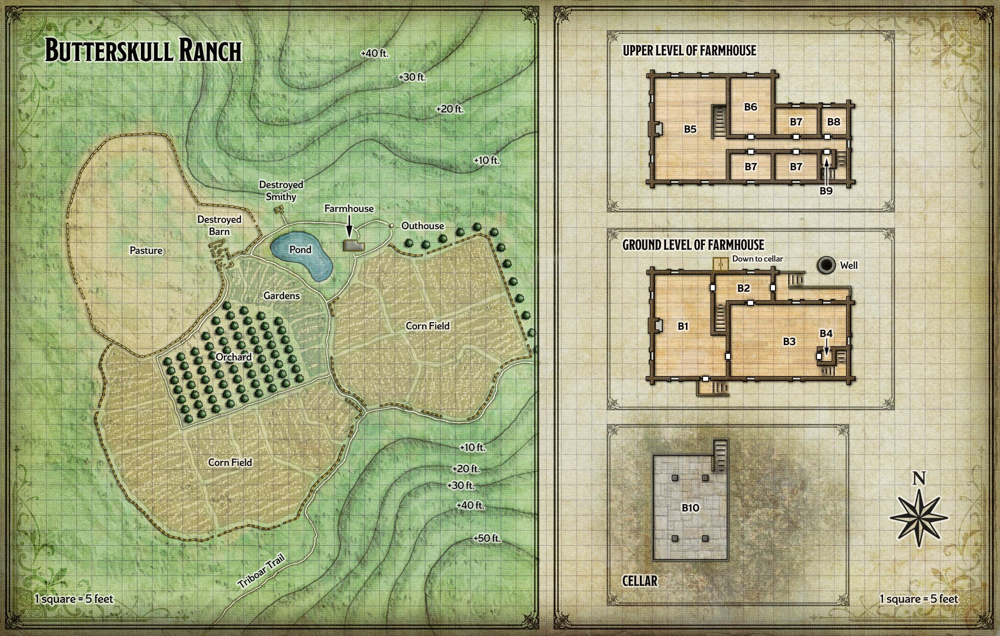
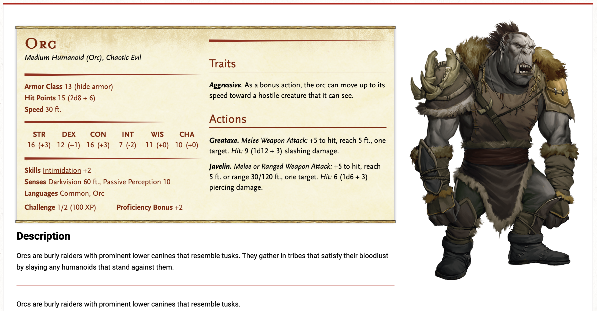

# Butterskull Ranch

**Quest Level: 2**

## Prep needed:

- Big Al's fit into the larger story. Maybe he is one of the candidates for the bolognese. Or maybe his butter is what makes the best bolognese in the region, so anyone who uses his butter could be a candidate for it?
- Maybe he tells the adventurers a secret code they can use to identify Harpers?

## Travel

The fastest and safest way to Butterskull Ranch from Phandalin is to follow the Triboar Trail northeast. The trek is 60 miles long, and characters can walk about 24 miles in a day. Thus, they can expect to take two long rests in the course of the journey.

They have these encounters, in no particular order:

### Petunia the Cow
Between Conyberry and the ranch, the characters spot Petunia the cow in a field a few hundred feet off the Triboar Trail. Petunia wears a cowbell around her neck. Characters who approach her spot a brand on her hindquarters: the letters BAK. Petunia has a calm, unflappable demeanor. If treated well, she follows her new benefactors everywhere.

### Horses in Conyberry

The abandoned town of Conyberry is eerily silent except for the whistling of the wind as it blows through the settlement’s burned and crumbled-down structures. As the characters make their way through or around the ruins, they spot three unsaddled riding horses grazing near an old well. Anyone who succeeds on a DC 10 Wisdom (Perception) check sees that the horses are branded with the letters BAK (for Big Al Kalazorn). A character who succeeds on a DC 15 Wisdom (Animal Handling) check can approach a horse without startling it, and can even ride it.

## Actual Quest

To complete the Butterskull Ranch Quest (“Follow-Up Quests”), adventurers must rescue Alfonse Kalazorn and either convince him to return to Phandalin or rid his ranch of orcs. Alfonse also wants help finding his prized cow, promising a splendid reward in exchange.

### Surrounding Lore

*Not established: As sheriff, he was anti ALL secret societies - from [Zhentarim](../plotlines/zhentarim.md) to [Harpers](../plotlines/harpers.md) to any others around. He tried to get all of the network influences out of Triboar, and ultimately that was what drove him out of the job. For that reason, the Harper's steer clear of him. He does recognize that they are the good guys, but he is opposed to them. Perhaps he is a True Neutral character.*

### Backstory

[Alfonse Kalazorn](../../npc_content/all_npcs.md#alfonse-kalazorn) used to be the sheriff of Triboar, a town to the east, where he was known as Big Al Kalazorn. He retired a decade ago, but retirement didn’t sit well with him. Looking for a new challenge, he claimed a plot of fertile land five miles east of Conyberry and turned it into a cattle and horse ranch. Later, he added a pig farm, chicken coops, vegetable gardens, corn fields, and an apple orchard. Most of his money comes from the sale of butter skulls — lumps of butter cleverly molded into the shapes of humanoid skulls. He sells his butter skulls primarily in towns to the east, although a few make their way to Barthen’s Provisions in Phandalin. Big Al’s butter is made from the milk of Petunia, his prized cow.

When the white dragon Cryovain drove the orcs out of Icespire Hold, they descended into the lowlands. A tenday ago, a small band of them attacked the ranch, freeing the pigs before setting fire to the barn and the smithy. A few other animals, including a dozen horses and Petunia the cow, escaped during the blaze. Big Al and five of his ranch hands were not so lucky. In their attempt to fend off the orcs, Big Al was captured and the ranch hands were killed. The only surviving hand escaped on horseback, fled to Phandalin, and delivered news of the attack.

### Locations and Events

When the adventurers come within sight of the ranch, read the following boxed text aloud:

> Butterskull Ranch occupies a large plot of land on the north side of the Triboar Trail, nestled between two hills. Beyond a ramshackle wooden fence stand corn fields, an apple orchard, gardens, and pasture land. A path breaks off from the trail to lead to a two-story farmhouse next to a pond. West of the farmhouse are the charred remains of a barn and smithy that have been burned to the ground.

Pigs harmlessly wander the fields, gardens, and orchard. Between the farmhouse and the gutted barn lie the scattered corpses of two orcs and five humans (ranch hands) swarming with flies. The bodies carry nothing of value.

#### Inside the farmhouse...

The farmhouse is a two-story log building with a pitched, shingled roof and a stone chimney. Its wooden doors are set with iron handles and hinges. Its windows are fitted with wooden shutters that can be bolted shut from inside. All the shutters are open when the characters arrive.

Raucous orcs dwell in the farmhouse, consuming Big Al’s ale and food stores. There are three times as many orcs as there are characters in the party, not including sidekicks. Place the orcs in areas B1 through areaB9 as you see fit. The orcs are not expecting trouble, but they fight to the death.

There are 18 orcs. 

#### B1 - Kitchen

The front door of the house leads into this area, which holds a large butter churn, worktables, shelves of foodstuffs and ale, and hanging pots and pans. Atop a small table is a skull-shaped wooden butter mold.

#### B2 - Empty Foyer

A creaky wooden staircase ascends from here to area B5.

#### B3 - Dining Room

Fight 1: There are 5 orcs in here.

This room contains two wooden trestle tables flanked by benches. Cattle skulls on the walls add to the decor.

#### B4 - Downstairs Closet

This closet contains shelves holding dinnerware.

#### B5 - Common Room

Fight 2: There are 6 orcs in here, 3 of them were playing cards when the adventurers walk in.

Padded chairs and game tables are arranged about this room. Scattered on the floor are Three-Dragon Ante playing cards and wooden Dragonchess pieces.

#### B6 - Big Al’s Bedroom

Fight 3: There are 2 orcs in here (gay?)

A large bed and a bulky cedar wardrobe dominate this room, which also has framed paintings of landscapes hanging on the walls.

**Treasure**. Any character who searches the wardrobe and succeeds on a DC 15 Wisdom (Perception) check finds a secret compartment at the bottom, stuffed inside which is a suit of [mithral chain mail](../../npc_content/magic_items.md#mithril-chain-mail).

#### B7 - Ranch Hands’ Bedrooms

Fight 4: The northern bedroom has 4 orcs. 

Each of these rooms contains two beds and two footlockers. Each footlocker contains neatly folded clothing and worthless personal effects.

#### B8 - Big Al’s Office

Big Al’s desk is buried under stacks of ledgers and papers chronicling ten years’ worth of business transactions.

**Treasure**. Characters who search the messy office find a small sack buried under the paperwork. It contains earnings and wages: a total of 65 gp, 145 sp, and 220 cp.

#### B9 - Upstairs Closet

Fight 5: There's one drunken orc in here, asleep.

This closet contains a mop, a broom, and a bucket.

#### B10 - Cold Storage Cellar

Wooden doors set against the north side of the farmhouse cover stone stairs leading down to the cellar. When the characters explore the cellar, read the following text:

> The cellar has a dirt floor, walls of mortared stone, and an eight-foot-high plank ceiling braced by wooden pillars. Tied to a chair is a large figure with a burlap sack pulled over his head. Shelves along the walls are lined with skulls made of butter and protected by a thin coating of wax.

The bound figure is Alfonse Kalazorn, a human veteran. It takes 1 minute for a character to free Big Al from his rope bonds. Having been beaten by the orcs, he has 9 hit points remaining and appreciates any healing the characters can provide. He is also without weapons and armor (AC 11).

Once liberated, Big Al can be convinced to abandon his ranch by any character who succeeds on a DC 10 Charisma (Intimidation or Persuasion) check. But he would rather stay, borrow a weapon, and kill any orcs that remain.

Big Al can’t turn a profit without his prized cow. He offers his suit of mithral chain mail (hidden in area B6) as a reward for her safe return. If the characters didn’t bring Petunia with them, they can scour the countryside for her. At the end of each hour spent searching, roll a d6. On a roll of 6, the party finds Petunia. If one or more characters search on horseback, they find Petunia on a roll of 5 or 6.

#### B1 - On the way out...

Big Al will be grateful for the help, as soon as all the orcs are taken care of. 

He tells the adventurers about some tell tale signs to identify Harpers

### Fights

#### Dining Room - 5 Orcs

#### Common Room - 6 Orcs

#### Big Al's Room - 2 Orcs

#### Ranch Hand Bedroom - 4 Orcs

#### Upstairs Closet - 1 Orc

## Follow up

He'll tell them all his theories about the secret societies in the area.
