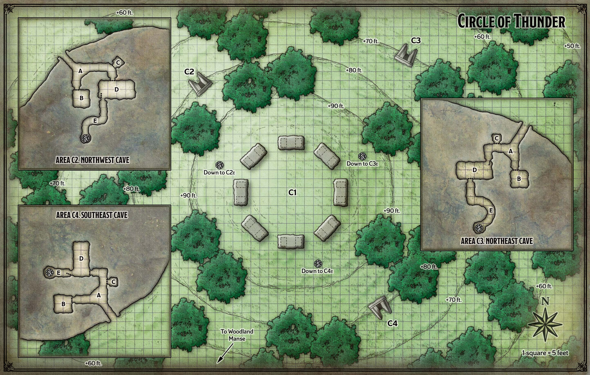
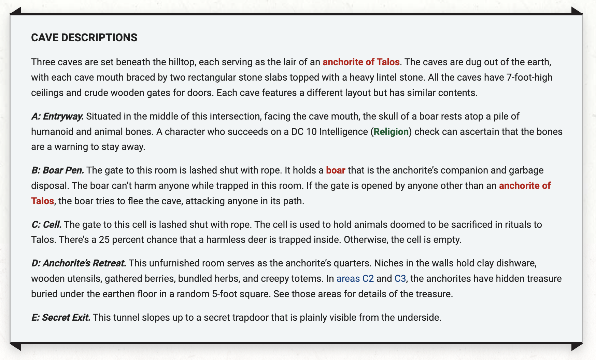

# Circle of Thunder

**Quest Level: 3**

## Travel

Characters traveling to the Circle of Thunder have the following two encounters en route. *They may also have custom encounters!*

### Tree Trap

This encounter can occur anywhere in Neverwinter Wood. Set the scene by reading the following boxed text:

> You come upon a sixty-foot-wide forest clearing, in the middle of which is a black, needle-like spire — a forty-foot-tall pine tree ravaged by fire long ago, its limbs burned off. Tied to the dead tree near its base are several ghastly dolls made of twigs bound with black hair.

Ten twig dolls are bound to the charred tree, all within easy reach. A detect magic spell reveals an aura of transmutation magic emanating from the tree and the ground in a 60-foot radius around it.

Close examination of a twig doll reveals something wrapped inside it. By breaking a doll apart, characters can see that it contains a still-beating pig’s heart. Any damage to a heart kills it and causes the dead tree’s roots to magically animate and erupt from the ground.

When the constricting roots erupt, each creature standing in the clearing must succeed on a DC 12 Dexterity saving throw or take 5 (2d4) bludgeoning damage and be restrained. The creature takes this damage again at the start of each of its turns until it escapes. A creature can use an action to free itself or another creature within its reach with a successful DC 15 Strength (Athletics) check, or by dealing 5 or more slashing damage against a root with a single melee weapon attack. The roots have AC 13 and immunity to all damage except slashing.

### Yargath's Patrol

As they move through the forest, the characters are beset by Yargath, an anchorite of Talos, and a band of 10 orcs. Set the scene as follows:

> As you make your way across uneven ground rising to a ridge, several hulking orcs ascend a similar ridge across from you, separated from you by a sixty-foot-wide, ten-foot-deep gully. The orcs unleash terrible battle cries as they are joined by a humanoid with elongated claws.

On the first round of combat, Yargath casts bless on up to three orcs. Meanwhile, the orcs charge across the ravine and close to melee range.

**Treasue**. Yargath carries a [potion of greater healing](../../npc_content/magic_items.md#potion-of-greater-healing).

Fight!

## Location Overview

The reclusive [anchorites of the Circle of Thunder](../plotlines/anchorites.md) gather on this hill to make sacrifices to Talos the storm god. In stormy weather, the anchorites also perform rituals to summon Gorthok the Thunder Boar, a destructive force they can unleash against their enemies. A circle of standing stones atop the hill helps to focus the anchorites’ magic to make the summoning of Gorthok possible.

Three anchorites — Flenz, Narux, and Yargath — defend the hill. When not performing rituals in the circle of standing stones, they patrol the surrounding woods, forage for food, and lurk in caves dug out of the hillside. When the characters arrive, the anchorites are gathered on the hilltop. If Gorthok has not been defeated yet, the anchorites are in the midst of summoning the great boar. Otherwise, they are conjuring a storm.

## Actual Quest

Characters coming from the Woodland Manse approach the Circle of Thunder from the south. Describe the location to the players as follows:

> Ominous storm clouds gather in the sky as you approach a ninety-foot-tall hill with trees spreading across its slopes. Atop the hill is a large ring of standing stones. Two ghastly figures dance within this henge, surrounded by a number of smaller capering creatures.

The standing stones and the dancing figures are described in area C1. Characters who circle the hill before climbing it spot three caves (areas C2, areaC3, and areaC4) near the hilltop.

### Locations and Events

#### C1 Henge

Atop the hill is a ring of eight upright stone structures, each one consisting of two 10-foot-high vertical stone slabs spaced 5 feet apart and topped with a 3-foot-thick flat lintel stone. These uprights can be toppled by creatures with a combined Strength score of 80 or higher.

In the middle of the circle, two humanoid figures dance around a deer carcass, each wearing the rotting head of a boar as a mask. These foes are Flenz and Narux, two anchorites of Talos. They are joined by 10 frolicking twig blights. Flenz and Narux are either performing a ritual to summon Gorthok the Thunder Boar, or they are making a sacrifice to appease Talos and call forth a storm. If the characters have not yet defeated Gorthok, the boar arrives once both anchorites are dead, appearing out of nowhere in the middle of the circle with a thunderclap. Gorthok fights to the death.

Secret Trapdoors. Any character who searches the hilltop and succeeds on a DC 10 Wisdom (Perception) check finds one of three flimsy wooden trapdoors hidden under the grass and dirt. Below these trapdoors are tunnels leading to areas C2, C3, and C4.

Each cave has these features:

#### C2 Northwest Cave

Carved into the lintel stone above the cave mouth is a picture of a boar chasing after a stick-figure humanoid.

**Treasure**. Flenz hides a [potion of invulnerability] in *her* quarters, buried in a random square beneath the floor.

#### C3 Northeast Cave

The lintel stone above the mouth of this cave is bare.

**Treasure**. Narux hides a [+1 shield] in *her* quarters, buried beneath the floor.

#### C4 Southeast Cave

Carved into the lintel stone above the mouth of this cave is a pictograph depicting three stick-figure humanoids being struck by lightning. Yargath keeps no treasure here.

### Fights

## Follow up

## To Do

This should wrap up most of the anchorite plotline, so a majority of the information the players need to understand them should have been seen before this or during this encounter.

These seems like an awkward encounter because the boar would probably be summoned before they search the cave quarters, so that probably wants some reworking too.

When they fight Yargath's patrol, it should leave some intriguing information.