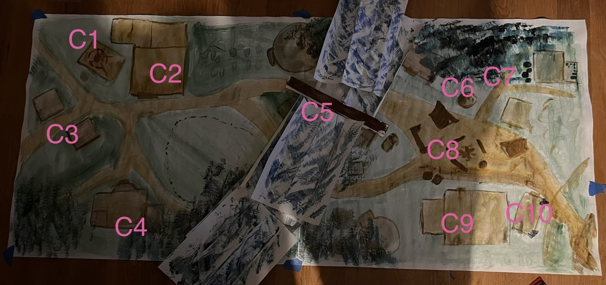

# Ruins of Coneyberry

**Quest Level: 2.5**

## Travel

Characters will pass through Coneyberry if they are traveling east on the Triboar trail from Phandalin, and will pass through Coneyberry on their way to [Butterskull Ranch](butterskull_ranch.md)

This is a homebrewed location and map so it's important to tell the players that there is a **one hour time limit** on this area, because it is not the focus of the session.

## Location Overview

This is the ruins of Coneyberry. This text will be read aloud once they arrive (slightly to the left of area C1). 

> The Triboar trail takes you through Coneyberry, and you arrive upon the ruins you were warned about. The town looks structurally like Phandalin, but much of it is still on fire. The area immediately south of the trail has a steep cliff, with some houses and forest still smouldering. The area immediately north of the trail seems to have a rolling forest fire. There is a low white and blue wall which cuts through the town, perpendicularly across the trail. Some rats are still running around the rubble, and occasionally a bird will fly past, but all traces of livestock is gone.

Players can take several split to investigate here, and some of the larger investigations include:

- Investigating a ruined building, a burnt building, a set of dragon claw marks and the ice wall - this will tell them the order of things that happened. First, displaced orcs drove many residents out of town, and in their rage, smashed many structures. Then, the dragon started to swoop and and fly off with live animals and villagers. Then, a third group (the anchorites) started searching, ransacking, leaving traps, ritual circle, setting up a campsite, and starting fires. The dragon came again, recently, probably in the past 24 hours, shooting an especially powerful ice breath across town. Finally, the third group returned to their campsite and set up a makeshift bridge for the ice.

- There is guaranteed to be a torn piece of the Iron Throne cape in C3. Players can find additional capes throughoout the area whenever the throw a nat 20 on any intelligence checks. If they find three (including C3) then the wizard Leto will be able to tell them that it is the symbol of the Iron Throne, which is a mercenary organization which has been inactive in the region for nearly 100 years, and still is not very influential anymore. It would be headquartes out east by Cormyr.

- They can investigate the animal movements they see around. Most rats, except the ones inside the rancher's house, will not let them approach, and are Harpers. If they kill one (and they will have advantage on evading attacks) then it will revert to its human form. If they connect this will the ruined shrine in the town center, then they will learn that this town is a Harper outpost.

### C1 - House with ritual circle

This is a plain house, throughoughly ransacked, with a ritual circle and a ritual totem. If the players do not destroy the totem, then an ankheg will appear in section C8 across the ice.

### C2 - Destroyed Inn

> The inn has a familiar feel, and with a pang you realize, though it's much smaller, the main area is set up very similarly to the Stonehill inn. There is no upstairs though, and only two small bed chambers in the back.

The destroyed inn can be searched, which yeilds 4d10 silver pieces and 4d6 rations. A **DC 12 investigation check** will find the maximum amount (49 silver and 24 rations) and will also give the insight: it's weird that this inn was so ransacked, but still so much food and money was around to find. Clearly, the ransackers were looking for something in particular.

In the back room, for a **DC 10 Investigation check**, they find some cleaned animal bones with appear to be used (or have been used) as head and arm armor. 

### C3 - Western Houses

The house closest to the edge is not covered up because the walls are so crumbled that the players can see clearly inside. If you search through the rubble you will only find a tear of a cape with the design on it. If the players find three of these throughout the day, then the Wizard will be able to identify it as the symbol of the Iron Throne. Additional ones will be given for nat 20 intelligence check rolls.

Standing house:

**Passive perception of 12** says that this house, though small, probably had 4-5 residents, a parent and some kids. The house was clearly deserted in a hurry: a basinet is on the ground, the bed is half stripped, etc. A DC 10 investigation check will show that this place wasn't just desered quickly, it was then searched by another group of people after it had been left. The pantry is totally empty, papers are strewn across the floor, and books have pages torn out.

Log:

There is also a small covered by paper area in the bottom left - this is a fallen log. When lifted with a **DC 25 strength check** (a helper can give advantage). If the check is missed, you can try again after a long rest. 

Underneath are thousands of baby spiders. For a **20 DC sleight of hand check**, you can dig through the spiders to grab whatever they are converging around. **On a failed save, you take 1d8 poison damage.** Either way, you grab a vial of acid and add to your inventory.

### C4 - Rancher's Estate

There are rats running about. Inside there is a longsword on the dining table. If picked up, it disintigrates and does an acid splash over the person who picked it up. **The acid splash is circled on the position of the sword, and has a dexterity save of 14. On a failed save, the target takes 1d6 acid damage.**

There are very large claw marks scraping the ground where the pasture is, and a suspicious lack of farm animals. You see what looks like a modest stable, totally ruined by fire. They can try to speak with animals on the rats, who will tell them about the looters and the regular dragon attacks. It seems there are a handful of ominous female figures who have been in and out of the camp - sometimes in a wildshape, sometimes in their humanoid form. And the dragon would come often, even after all the large animals were gone.

A **DC 10 survival check** will show horse shoe prints, dragon track marks which range from over two weeks old to only two or three days old, boar foot prints, and many rat tracks as well.

The estate has been totally sacked, and is full of rubble.

### C5 - Precarious Bridge

> As you approach the blue wall, you realize it is fully a wall of ice. There has been a path carved out and a rickety bridge layed out which cuts across it. It is narrow. A small creature can traverse the bridge without difficulty, but a medium creature will have to be sufficiently acrobatic to avoid taking ice damage.

A medium creature must pass a **DC 15 acrobatics check** or take **2d6 cold damage**. Upon crossing the bridge, the rest of the map will be revealed.

> You see the other of Coneyberry ahead of you, and it looks just like the first half: ruined, burned, looted. Not a soul in sight.

### C6 - Ruined Well & Eastern House

This well is ruined, and inside is soot. A **DC 10 investigation** check will show that the inside of the well is effectively poisoned with the amount of ash and rotting animals inside.

The house across the path is covered by paper because the walls still have enough structure that the players cannot see inside. **The door does a shocking grasp for 1d8 damage if the roll (if the player is wearing metal, its a roll with advantage) exceeds their AC.** Once inside is just more rubble and clear ransacking. A DC 10 survival/perception check will show that there was two different passes in this house, first it was destroyed with reckless abandon, and then it was carefully searched.

### C7 - Potter's Home

Read this as you approach:

> This house on the edge of the woods seems to have been partially burned - still, the structure remainds standing. To the left of the front door is a stone bench with several familiar items. Large intricate vases, with ornate blue decorations. These are smaller than the one you've seen before.

Inside the house has been "partially ransacked", which a **DC 10 investigation** check will tell - probably because of the "partially burnt" nature of everything. In the back room is a bunch of vases again - smaller than the ones outside. If they choose to search each vase, it will take 2 hours. If they break the vases, they will then have to sort through the rubble, which will take 3 hours, because of all the fine pieces. If they choose the correct vase to search, it will be instaneous. Describe the vases like this:

> There seem to be hundreds of vases in the room, on the shelves and the ground - even some hanging from ropes from the ceiling. They seem extremely fragile. 

With a **DC 15 investigation**, they can see that a few vases look different: there a vase with red decorations on the top shelf, a vase hanging from the ceiling which has almost a square quality to it, a vase with blue decoration on the bottom shelf, an undecorated, raw, brown vase in the back of the second shelf, and a vase with an intricate handle on the third shelf. All the shelves are so tightly packed, it will be an increasingly hard task to check them. **DC 15 sleight of hand**, then **DC 20 sleight of hand**, then **DC 25 sleight of hand**, etc. The players can convince you that they get advantage if they try!

Inside the plain vase is a small map, which should be a map keyed to the Phandalin map. It will show a secret basement under Marla's house which is a Harper stronghold.

> You suspect that this is what the raiders were searching for!

### C8 - Makeshift Campsite

In this town center there is a sort of makeshift campsite. Two tents, recently deserted, and a stamped out campfire. There is a large pile of stones, which seem to have been intentionally placed, and then intentionally kicked over.

It looks like someone was practicing wood carving by the fire, and left some in progress work. If someone figures out that the in progress work looks like Arfer's dream totem, then the Wizard they are traveling with will tell them it is a token in service of the choas god Talos, and that there have always been shapechanging acolytes (anochorites?) in the area, who use their boar wildshape to honor their god and cause havoc to the burgening industry.

### C9 - Trapped Storehouse

**The front door does shocking grasp for 1d8 damage if the roll (if the player is wearing metal, its a roll with advantage) exceeds their AC.** Inside doors will **explode (DC 14 dexterity save) doing 1d8 force damage on a failed save and 1d4 damage on a successful one.** The explosion is a 20 ft cone coming from the door.

In each room, the room is totally empty. In the last room they find, there is a chest, with a **DC 20 sleight of hand** check. The chest is empty as well. With a **DC 10 investigation check** they find a false bottom. If they open up the false bottom, the chest explodes in a 20 ft radius, with a **dexterity DC 15 save, dealing 2d8 damage on a failed save and 1d8 damage on a successful save.**

### C10 - Real Storehouse

The storehouse is locked, and needs a **DC 20 sleight of hand**, or a **DC 15 strength**. Inside they find all the looted valuables from the town. This includes:
- 4 large paintings, each weighing XX and valued at 20 + 2d4 GP*
- 2 identical delicate vases to the one back at the inn, just like with the first one, the value is unknown, and walking it to Phandalin will double your walking speed. Only one can be carried per person.
- 250 GP
- 180 SP
- 3 Healing potions
- A cookbook, a brewer's book and an alchemist's book** - each is 3 lb and is valued at 15 GP
- 5 boxes of children's toys, love letters, small family paintings, etc - each is 25 lb

A **DC 10 perception check** will show that not only were these items not trapped, but also, it seems the more sentimental an item is, the more gently it was placed around the room.

*Note: not every merchant will buy items like this. They can sell to Pickled Pete at 75% of its value, or wait around for a merchant with more of an appraisal ability, which will buy the pieces with a better premium

**Giving the alchemist's book to Harbin will allow him to start making cold resistance elixers.

