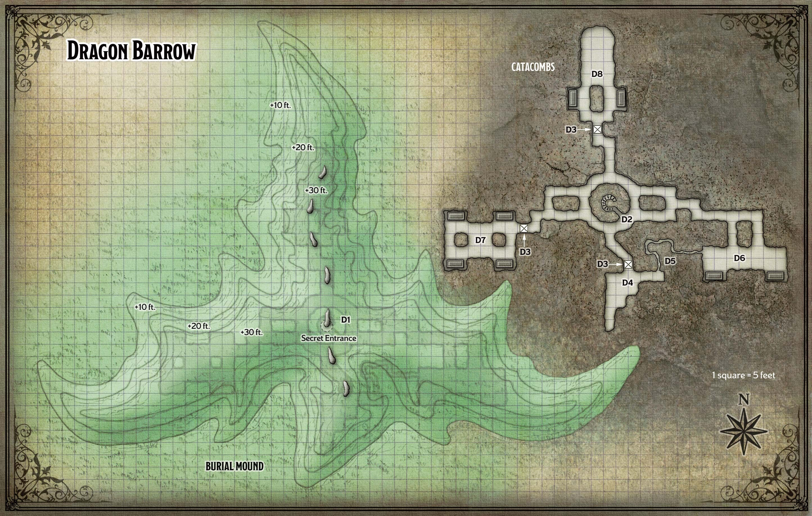
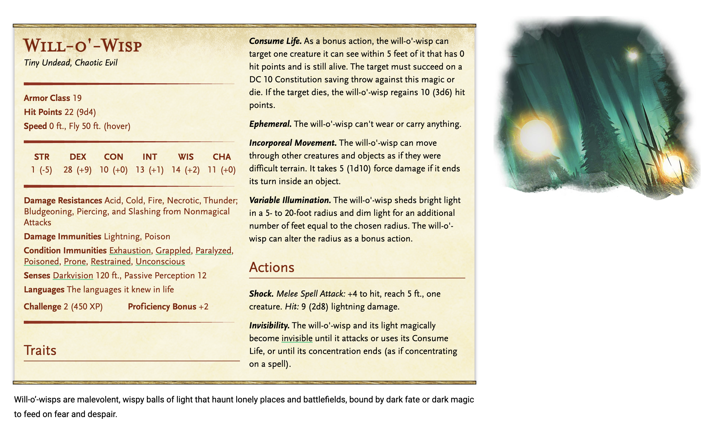
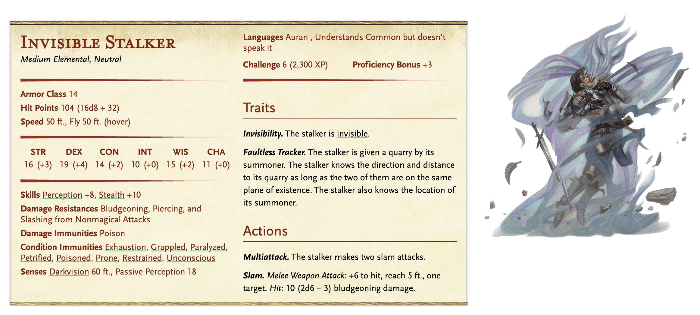

# Dragon Barrow

**Quest Level: 3**

## Travel

The barrow is roughly 40 miles northwest of Phandalin, amid the rolling hills and grasslands between the High Road and Neverwinter Wood. Since the characters can travel roughly 24 miles in a day, they should expect to take one long rest in the wilderness before arriving at the barrow on the second day of their trek. A cold wind blowing in from the coast assails them for most of the trip, bringing occasional rain.

## Actual Quest

The object of the quest is to retrieve the sword. Perhaps I can incorporate some elements to help them learn more about the overall narrative, or perhaps [Xanth](../../npc_content/all_npcs.md#xanth) can be a helpful recurring NPC akin to Facktoré.

### Surrounding Lore

The Lady Tanamere Alagondar was a [Harper](../plotlines/harpers.md). If the players know XYZ about the Harpers and their aims before entering the area - it will help them in some ways?

For the most part, this encounter is unchanged though.

### Backstory

Lady Tanamere Alagondar was a royal scion of Neverwinter more than a century ago. Along with two parties of adventurers, she fought and killed Azdraka, a green dragon that had long terrorized the High Road. Lady Alagondar died in the battle and was laid to rest beneath a barrow near where the dragon fell. The remains of her fallen compatriots and the corpse of Azdraka were sealed in the barrow with her, in accordance with Lady Alagondar’s dying wishes.

### Locations and Events

When the players arrive, read this:

> A thirty-foot-high hill rises ahead of you, its top too flat to be a natural occurrence. Jutting from the grassy hilltop is a row of ten-foot-tall, bone-white rocks that arc toward the stormy sky like outstretched talons.

Then, the centaur will notice them and approach peacefully.

After being driven from his home in Neverwinter Wood by marauding orcs, Xanth the centaur has taken refuge in the hills around the barrow. When he spots the characters, Xanth approaches peacefully and shares the following warnings:

- “Strange witchlights hover over Dragon Barrow at night. The hill is haunted by the restless spirits of the dead.”
- “Neverwinter Wood has become overrun with orcs in league with half-orc spellcasters. Deep in the forest, atop a cave-riddled hill, is a circle of standing stones where the evil half-orcs perform their dark rites.”

Xanth avoids Dragon Barrow and would like to see the evil half-orc spellcasters of Neverwinter Wood driven off or killed. He offers to guide characters to the [Circle of Thunder](circle_of_thunder.md) if they wish to take on the half-orcs there, and is willing to wait until the characters are done exploring the barrow. The Circle of Thunder is roughly 40 miles away, deep within the forest.

Characters who climb to the top of the barrow and survey it notice its distinctive dragon-like shape with a successful DC 10 Wisdom (Insight) check. The pale rocks resemble spikes protruding from the dragon’s back.

At night, the will-o’-wisps in area D2 emerge from the hill using their Incorporeal Movement and float above the barrow, hoping to attract prey with their lights. If they detect characters nearby, the will-o’-wisps turn invisible and withdraw into the barrow.

#### D1 - Secret Entrance

One of the white rocks atop the hill acts as a stone plug embedded in the earth. Characters searching the hilltop can spot a opening beneath the base of the rock with a successful DC 10 Wisdom (Perception) check. By lashing ropes around the top of the rock, the characters can topple it with a successful DC 19 Strength (Athletics) check. A knock spell also causes it to topple over. The opening beneath the rock reveals a 2-foot-wide spiral staircase with flagstone steps, descending 30 feet to area D2.

#### D2 - Will-o'-Wisps

The tunnels around the spiral staircase are haunted by three will-o’-wisps. The wisps are invisible until they hear intruders coming down the stairs, whereupon they illuminate and move to the far side of the three concealed pit traps (area D3), hoping to lure intruders to their doom. Each wisp has its own pit and attacks any character who falls into it. A wisp reduced to 7 hit points or fewer turns invisible on its next turn and flees to hide until the characters leave the barrow.

#### D3 - Concealed Pit Traps

Each of these pits is 5 feet wide, 10 feet deep, and dug out of the earth. Rows of rusty swords are embedded into the floor of each pit, whose tops are covered by rotted wooden planks hidden under a thin layer of earth. A creature using a pole or similar tool to prod ahead detects the pit with a successful DC 10 Wisdom (Perception) check.

Any creature that steps onto a pit falls into it, taking 1d6 bludgeoning damage and impaling itself on 1d4 swords, each of which deals 1d6 piercing damage.

#### D4 - Skeletal Surprise

The bones and rotting saddle of Lady Alagondar’s horse lie in the southern niche of this cavern. When a creature approaches within 5 feet of the bones, they knit together and rise as a skeletal horse. This steed has the statistics of a riding horse, except that it’s undead. It bonds with any character who wants to ride it.

#### D5 - Narrow Tunnel

This tunnel is only 2 feet wide. At the halfway point, a 5-foot-long pressure plate is hidden under a 2-inch-thick layer of earth. A character prodding ahead with a pole or similar tool can detect the plate with a successful DC 10 Wisdom (Perception) check. The first character to step on the plate causes the walls of the tunnel to collapse inward, burying all creatures in the tunnel. A buried creature is blinded and restrained, has total cover against attacks, and begins to suffocate when it runs out of breath (see “Suffocation” in the Basic Rules). Only a creature that is not trapped in the tunnel can clear away the collapse, using an action to open up the 5-foot-deep section of tunnel closest to it. A creature in that space is no longer buried.

#### D6 - False Tomb

> Sarcophagi. The sarcophagi found throughout the catacombs are carved from solid blocks of granite and sealed with heavy granite lids. The seals are airtight. Lifting a lid requires a successful DC 20 Strength (Athletics) check. Each lid is a Medium object with AC 17, 12 hit points, and immunity to poison and psychic damage.

Two sealed stone sarcophagi rest in alcoves dug into the south wall here. Each sarcophagus releases a cloud of corrosive dust when opened, filling the 10-foot-by-10-foot area north of the sarcophagus. Any creature in the area must make a DC 15 Dexterity saving throw, taking 14 (4d6) acid damage on a failed save, or half as much damage on a successful one. The cloud then disappears. The sarcophagi contain nothing of interest.

#### D7 - Adventurer's Sepulcher

Four sarcophagi in alcoves contain the moldy bones of adventurers (a bard, a cleric, a fighter, and a wizard) who perished fighting Azdraka.

**Treasure**. The northwest sarcophagus contains the dead bard, who was buried with a [lute of illusions](../../npc_content/magic_items.md#lute-of-illusions). Sealed with the dead wizard in the southeast sarcophagus is a [necklace of fireballs](../../npc_content/magic_items.md#necklace-of-fireballs).

#### D8 - Dragon Slayer

Two sarcophagi in alcoves contain the moldy bones and rusty armor of Tanamere Alagondar and her faithful squire, but hold nothing of value. The area north of the sarcophagi has the bones of Azdraka, a Huge dragon, embedded in its walls. The dragon’s skull rests on the floor and has a longsword set atop it.

Treasure. The sword is Lady Alagondar’s [dragon slayer](../../npc_content/magic_items.md#dragon-slayer). If the sword is taken, an invisible stalker appears and attacks anyone in this area until the sword is put back, or until that guardian is destroyed.

#### D1 - On the way out..

Xanth is waiting for them - hoping they will take him up on the offer to go to the Circle of Thunder. He will make it seem increasingly urgent!

### Fights

**Will-o'-Wisps**

WW 1 [ 22 ] / [ 22 ]

WW 2 [ 22 ] / [ 22 ]

WW 3 [ 22 ] / [ 22 ]

**Invisible Stalker**

[ 104 ] / [ 104 ]

## Prep needed:

- Tie into Harpers
- Addtl characterizations for Xanth
- Map
- 1 centaur
- 1 skeleton horse
- 3 will o wisps
- 4 sarcophogi (does not need to be printed, just made)
- 1 invisible stalker

## Follow up

Refer to Circle of Thunder for follow up regarding Xanth. If the players never go to the circle, they do not hear from Xanth again. If they go to the Circle at a later time, instead of immediately following this quest, then they will find Xanth, slightly disapointed at their lack of initiative, in the arrival area of the circle.