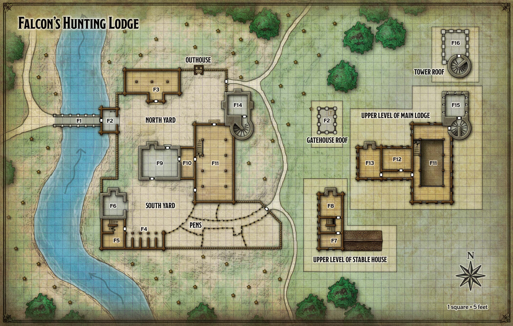

# Butterskull Ranch

**Not a Quest Location**

Todo: add in investigation checks, and Falcon dialogue.

## Goals

Though this is not a quest location, it is midway between locations, found in the Neverwinter Woods. It could be a stop on the way to the [Logger's Camp](./loggers_camp.md) or the [Woodland Manse](./woodland_manse.md), and it offers a little more insight into the [Zhentarim](../plotlines/zhentarim.md) plot.

### Surrounding Lore

When the players first arrive, they will see Falcon and Pell sending off their current guest, a wealthy merchant from Neverwinter named [Randal Grand](../../npc_content/all_npcs.md#randal-grand). Eve is given the opportunity to role play how exactly she knows this man, and the group does not necessarily meet him directly. However, this will make the group suspicious of Falcon (at least to start).

### Backstory

Falcon the Hunter maintains this hunting lodge to cater to nobles from Neverwinter. He offers his services as a guide to those nobles, most of whom wouldn’t last long in the forest without his protection and survival skills. Falcon abhors city life, preferring a rustic existence and simple pleasures. His lodge has all the creature comforts he requires, though he never turns down a good bottle of wine (or even a bad one) from a visitor.

Falcon has two retainers: an elderly, world-weary cook named Corwin, and a mute twelve-year-old stablehand named Pell. Both are noncombatants. If asked, Corwin will cook the prized Bolognese, fullfilling the [bolognese secret goal](../secret_goals/4no_nose_for_bolognese.md).

In addition to the main house, the hunting lodge grounds include a guest house for visitors, a conjoined stable house and smithy, an outhouse, and pens to hold Falcon’s livestock. Accustomed to long and lonely winters, Falcon keeps a season’s worth of provisions in his pantry at all times, supplementing those stores with fresh game. He has also begun hunting orcs and mounting their heads in his trophy hall. Corwin has advised Falcon not to do this for fear of retaliation, but Falcon has a long history of killing orcs and can’t abide them as neighbors.

Visitors are free to stay in the guest house and dine with Falcon at no charge. For discriminating guests, Falcon offers a comfortable private room in the main lodge (area F12) for 10 gp a night.

### Locations and Events

#### Arrival

The players will start in the bottom left corner of the map. Upon arrival, this is read to the players:

> A thin fog surrounds a fortified compound standing in a clearing on the east side of a narrow river. A ten-foot-high log palisade surrounds the compound, whose main building is a two-story stone-and-wood affair with a high-pitched roof, gables, window shutters, and a stone chimney. Attached to the main building is a blocky tower of gray stone, its high roof lined with battlements. Other structures include a two-story stable house and a gatehouse whose flat roof is enclosed by iron railings. A stone bridge spans the river, ending before an oaken door set into the gatehouse’s outer wall. Mounted next to the door is a bell with a short rope hanging from its clapper.

> You see three figures and a horse on the bridge. A towering man, well over 6 feet tall, with jet black hair and a large fur coat draped over his shoulders. A small human boy, still in adolescence. He is packing up the horse. Finally, a man with two long braids. He turns and the group can see his face, though its clear that he does not notice you. His wealth eminates from his figure, even at this distance. His horse has the sigil of a rich Neverwinter noble family. 

> Eve, with a shock, realizes she knows this man from her days in the city.

The players wait for the man to pass.

Notes on Falcon from the book:

Falcon the Hunter wears a fur-lined cloak over his studded leather armor. He stands 6 feet, 6 inches tall, and has black hair and broad shoulders. His eyes are as blue, cold, and sharp as ice, and he sports a neatly trimmed beard. Falcon moves with the casual confidence of one who fears nothing, and he greets every concern with nonplussed indifference. He loves good wine and treats other people as he would like to be treated — fairly and with patience.

Falcon’s real name is Gustaf Stellern, but he has long since abandoned it. His hunting skills have earned him the name he now bears. Given the chance, he shares the following useful information with the characters:

- “I’ve seen more orcs in the woods of late. Ugly brutes.”
- “The orcs appear to be in league with the evil half-orcs that dwell southeast of here. These half-orcs are often seen in the company of little stick creatures known to creep about these woods. All in all, a nasty lot.”
- “The half-orcs dwell in a ruined stone manse overgrown with vines, roughly ten miles from here. Tales say that the manse was built by a scholar who studied the elven ruins scattered throughout these woods.”

#### F1 Stone Bridge

The 5-foot-wide stone bridge that spans the river is sturdy and newly built. This is the area of the scene between Falcon and the Neverwinter man.

If the characters announce their arrival by ringing the bell or yelling over the walls, Corwin makes his way over to assess them from the gatehouse, slides back the heavy wooden bar securing the outside door, and lets them in. If the characters have horses or pack animals, Corwin has Pell look after them while he shows the characters to the guest house (area F3) to store their gear. He then leads them to the dining and trophy hall (area F11) before fetching Falcon, who is usually in his quarters at area F13.

#### F2 Gatehouse

A wooden ladder climbs to a trapdoor in the ceiling that grants access to the gatehouse’s 12-foot-high rooftop. A flagpole in the northeast corner of the roof sports a black banner with a silver falcon insignia.

#### F3 Guest House

The guest house has a barn-like quality. A carpet of straw covers the dirt floor. Arranged about the room are nine cots that come with soft pillows and thick wool blankets.

#### F4 Stables

Falcon’s riding horse, a reliable gray stallion named Baatorius, is usually lodged in the westernmost stall. The other stalls are empty.

#### F5 Storage

Riding gear is kept here, along with food for the animals. This room has the stairs which lead to the upstairs of the stable house

#### F6 Smithy

The smithy is mostly used to forge horseshoes, but guests can also use it to repair weapons and armor.

#### F7 Pell's Bedroom

The stablehand’s bedroom is plainly furnished.

#### F8 Corwin's Bedroom

Corwin likes to keep a fire always burning in the fireplace of his modestly outfitted bedroom.

#### F9 Kitchen

Originally, Falcon’s lodge consisted entirely of this stone building and the outhouse north of it. When the lodge grew in size, this building became the kitchen.

#### F10 Pantry

Nonperishable foodstuffs and ale casks are stored here.

#### F11 Dining and Trophy Hall

A second-floor trophy gallery opens up above an oak dining table surrounded by tall-backed chairs on the main floor. Two iron chandeliers hang from the high rafters. This also contains stairs to the upper level of the main lodge.

**TODO: PLACE INVESTIGATION CHECKS HERE. PERHAPS ABOUT ORCS, ANCHORITES, AND IRON THRONE**

#### F12 Deluxe Guest Bedroom

For 10 gp a night, wealthy guests can enjoy the comforts of this luxurious bedchamber, including a washbasin, a box of pipeweed, and a down-stuffed mattress.

#### F13 Falcon's Bedroom

Falcon’s bedroom is cozy and warm, but untidy.

#### F14 Tower Basement

This dirt-floored room is used for cold storage.

#### F15 Tower Guard Post

Arrow slits line the walls of this empty guard post.

#### F16 Tower Roof

This 30-foot-high roof offers an unobstructed view of the clearing around the lodge and the nearby woods.

## Follow up

If you bring Falcon a nice wine - or an exotic, hard to find wine - he will treat you to a dinner and a story. He will also give you the quest [Woodland Manse](woodland_manse.md)

