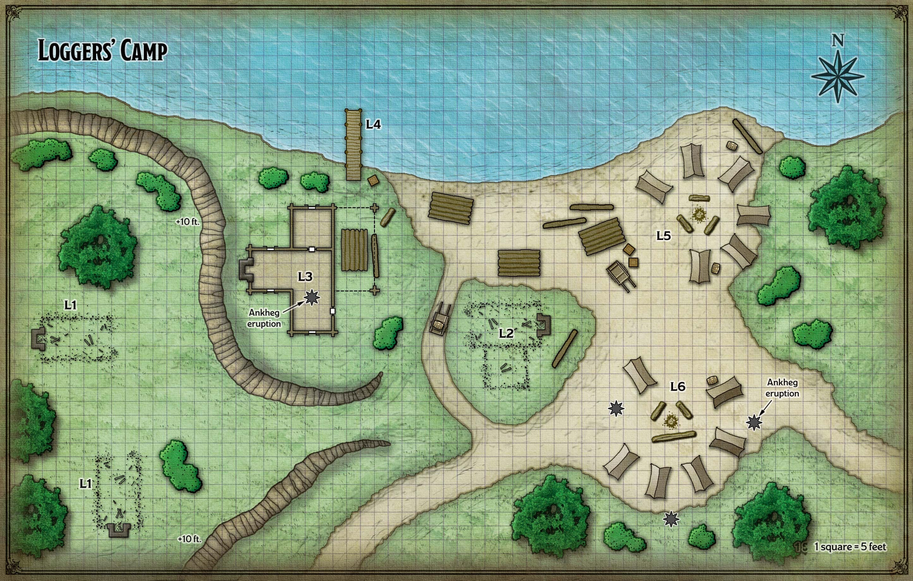

## Loggers Camp

**Quest Level: 2**

### Prep needed:

Physical bits:
- Ankhegs?
- Boar

Planning bits:
- Puzzles relating to the "tremorsense"

Goals prep:
- Maybe ?

Ideas:
- This is about Tibor Wester, making sure he is safe. Just like his brother, he hides behind a door. But he can be persuaded to leave the room, and even allow himself to be transported back to town to see his brother (provided that they also escort him back on the next daylight).

## Travel

The characters can travel 24 miles in a day, and the loggers’ camp is roughly 50 miles north of Phandalin. The characters will need to take a long rest near the halfway point in their journey. They can choose to camp in the woods or veer eastward and spend their long rest at Falcon’s Hunting Lodge.

The party member with the highest Wisdom (Survival) modifier is the most qualified to navigate Neverwinter Wood. Use the map of the Sword Coast to chart the characters’ progress through the forest. Whenever the characters enter a new hex on the map, have the navigator make a DC 10 Wisdom (Survival) check. If the check succeeds, the party stays on course. If the check fails, the party gets back on course after wasting 1d4 miles of movement going in the wrong direction.

### Before leaving town...

The characters need to pick up the supplies for the loggers’ camp before setting out. Harbin Wester has made the necessary arrangements with Barthen’s Provisions in Phandalin. When the characters arrive to pick up the supplies, read the following boxed text aloud:

> Barthen tells you that his clerks have filled two crates with supplies as he hands you a sheet of parchment, upon which is written an inventory of the crates’ contents: foodstuffs such as dried meat, blocks of cheese, and loaves of bread, as well as casks of ale and flasks of oil. The two heavy crates are loaded onto a two-wheeled cart pulled by an ox. “The ox’s name is Vincent,” says Barthen. “I’ll expect to see him and the cart returned, thanks.”

The ox (use the cow stat block) is a reliable beast. Each full crate holds enough provisions to sustain twelve people for a month, as long as the supplies are supplemented with fish and fresh water from the camp.

If the characters tell [Barthen](../../npc_content/all_npcs.md#elmar-barthen) that they intend to visit Falcon’s Hunting Lodge on the way, Barthen suggests they buy a bottle of fine wine (10 gp) and give it to Falcon as a gift.

And on the way..

### A Boar-ing Encounter

Shortly after entering the woods, the characters have an encounter that is not what it seems. Read the following boxed text aloud:

> About sixty feet ahead of you, a wild boar stands in a small clearing. The boar glares at you suspiciously.

The boar is actually a female [anchorite of Talos](../plotlines/anchorites.md) in boar form. The anchorite, Drethna, attacks only in self-defense. If the characters circle around the boar or otherwise avoid a confrontation, they can continue on their way. If the boar is spared, it darts off to warn the anchorites at the [Woodland Manse](./woodland_manse.md) that strangers have entered the forest.

## Actual Quest

To complete the Loggers’ Camp Quest, the adventurers must deliver supplies to the camp and have Tibor Wester sign for them. Tibor’s signature assures Harbin Wester that the supplies reached their intended destination.

### Surrounding Lore

- Tibor and Harbin's estrangement
- Anchorites plan to devastate this camp first
- Zhentarim are opportunists about these supply lines

### Backstory

Years after the eruption of Mount Hotenow, the city of Neverwinter continues to rebuild itself after the destruction wrought by that event. Loggers have set up camps along the river that flows out of Neverwinter Wood, using the river to transport logs to the city.

One particular camp, located on the south side of the river, is run by a craven opportunist named [Tibor Wester](../../npc_content/all_npcs.md#tibor-wester), the half-brother of Phandalin’s townmaster, [Harbin Wester](../../npc_content/all_npcs.md#harbin-wester). Tibor employs skilled loggers to find the best trees, chop them down, and haul them back to the camp to be sent downriver. He gets his supplies from [Phandalin](./phandalin.md) so that he doesn’t have to pay the outlandish “devastation tax” that Neverwinter applies on essential goods. The challenge lies in getting the supplies safely through Neverwinter Wood, which is why Harbin uses adventurers to make deliveries.

Tibor and Harbin are estranged, partially driven by their mutual non-confrontational natures. Each man is prone to hide behind a door.

Tibor has a bigger problem than supply lines, however. His loggers have drawn the ire of [anchorites of Talos](../plotlines/anchorites.md), who resent intrusions into their territory in Neverwinter Wood. The anchorites have hidden a totem in his camp that has attracted ankhegs. The burrowing monsters caught the loggers by surprise, killing all twelve of them. Tibor survived by locking himself in his office, where he intends to remain until someone rescues him.

### Locations and Events

#### L1 - Cabins on the Rocks

These cabins have been mostly torn down, but their ruins stand atop a 10-foot-high escarpment of rock that the ankhegs can’t burrow through.

#### L2 - Old Cabin and Chimney

All that remains of this cabin is a ruined fireplace whose chimney has mostly collapsed, and a stone foundation that the ankhegs can’t burrow through.

**Totem**. A character who searches the chimney finds a totem buried in its debris: thirteen tiny, androgynous stick figures dipped in pig’s blood, inscribed with tiny lightning bolt symbols, and tied together in a bundle with hair. A character who succeeds on a DC 15 Intelligence (Religion) check can discern that the totem’s purpose is to bring ill fortune to all who reside near it. Destroying the totem causes any ankhegs that haven’t attacked yet to lose interest in the camp and burrow away.

#### L3 - Office and Tool Storage

This cabin has a wooden floor and is divided into two rooms. The larger room is cluttered with logging equipment (saws, leather harnesses for climbing trees, and so on). An ankheg is hidden under the floor. The first time a character crosses the room, the ankheg bursts through the floorboards in the square marked “ankheg eruption” and attacks.

Tibor Wester, a human commoner, has barricaded himself in the smaller office to the north. He has pushed his desk against the door and huddles atop it. When faced with any decision, Tibor makes the most cowardly, self-serving choice.

#### L4 - River Dock

Rowboats and river barges can be moored here, though there are none present when the characters arrive.

#### L5 - North Camp

A dead campfire is surrounded by six tents, each containing a bedroll and a mess kit. Further inspection reveals that the tents and bedrolls have been partially dissolved by some kind of acid spray. Footprints and strange marks in the sand suggest several humanoids were attacked here and dragged away. Any character who succeeds on a DC 10 Intelligence (Investigation) check can deduce that the humanoids were killed and dragged down into the sand by burrowing monsters. Ankhegs collapse their tunnels behind them, leaving no way to follow them.

#### L6 - South Camp

This camp is similar to area L5, but three ankhegs are hidden underneath it. When a creature steps within 20 feet of a square marked “ankheg eruption” on the map, a hostile ankheg bursts out of the ground in that square and fights until slain.

### Fights

## Follow up

