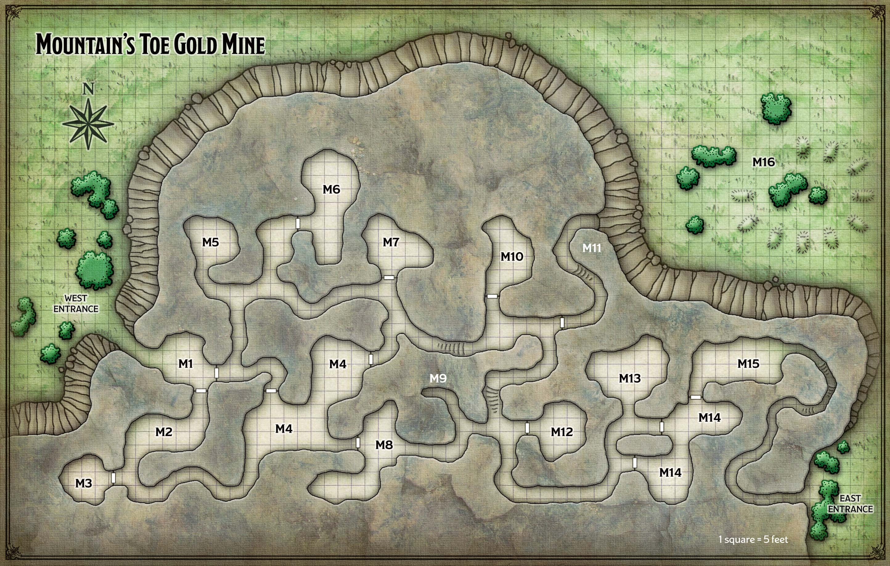
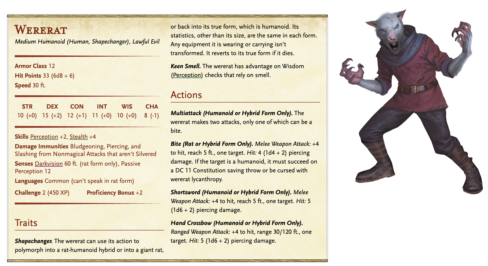
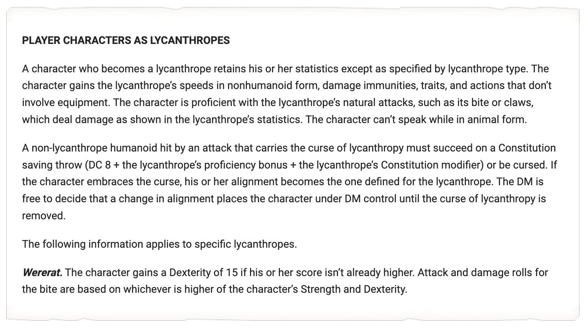
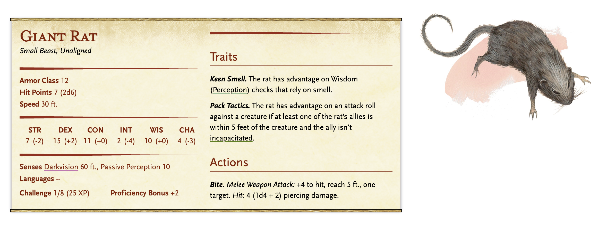

# Mountain's Toe Gold Mine

**Quest Level: 2**

## Prep needed:

Physical bits:
- Wererats both forms

Planning bits:
- Puzzles relating to the "tremorsense"
- Notes that say "The PME will help me see!"

Goals prep:
- Maybe ?

Ideas:
- This is about Don-Jon Raskin. Players will learn that he has NOTHING to do with the Zhent (Im sure they will pry). Instead, he is a pawn amongst several games. 
- Using detect magic or a very high investigation check shows that there is a spy bug construct which is embedded into the goggles

## Travel

The fastest way to reach the mine from Phandalin is to head northeast, skirting the foothills of the Sword Mountains. The mine is only 15 miles from Phandalin, so if the characters leave at dawn, they’ll be there before sunset.

But they will NEED to rest soon after arriving.

### On the way there, dead orcs

When the party gets within five miles of the mine, read the following boxed text aloud:

> A low ridge rises to your right, beyond which you see the Sword Mountains scrape the gray sky. But closer in, something is strewn across the rocky ground ninety feet ahead.

> “Well, ain’t that something,” says Don-Jon, pointing at what appear to be six dead orcs.

The orcs were killed by Cryovain the white dragon. They are clad in hide armor, and their greataxes and javelins litter the ground around them. Any character who examines the corpses and succeeds on a DC 12 Wisdom (Medicine) check can determine that extreme cold killed the orcs about three days ago. If the players can’t piece together what happened, Don-Jon says, “Looks like a white dragon saved us from some trouble.”

## Actual Quest

To complete the Mountain’s Toe Quest, the adventurers must escort Don-Jon Raskin safely to the mine. Once he sees that wererats have infested it, Raskin urges the characters to eradicate the “varmints.” If the characters refuse, Raskin is left to negotiate a truce with the wererats on his own — and is quickly turned into one.

### Surrounding Lore

The Mountain’s Toe Gold Mine, owned by a business consortium in Neverwinter, has been troubled by recent productivity problems. The owners have hired a no-nonsense overseer named Don-Jon Raskin to sort things out. But neither Raskin nor the owners know that the troubled mine has recently been taken over by a band of wererats calling itself the Whiskered Gang.

### Backstory

### Locations and Events

The characters arrive at the west entrance to the mine, which you can describe as follows:

> Hidden among bushes, a tunnel burrows into the foot of a soaring, snow-capped mountain. Above the mouth of the tunnel is a wooden plank with the words “Mountain’s Toe” carved into it in Common.

Don has never been to the mine and does not have a map, and can't help with navigation

MINE FEATURES

All tunnels and caverns in the mine are hewn from rock that has thin veins of gold ore running through it. Other common features are described below.

Ceilings. Ceilings throughout are 8 feet high and braced at regular intervals by wooden pilasters and beams.

Doors. All doors are made of wood with iron hinges and handles. The doors are fitted with locks, but none of them are locked. The keys needed to unlock and lock them are gone — stolen by a previous overseer who fled the mine.

Light. Oil lanterns hang from ceiling hooks in every room and tunnel.

#### M1 - Guard Post

This cave is guarded by two female wererats in hybrid form. They offer to escort new arrivals to the mine’s overseer, Zeleen Varnaster, in area M4.

#### M2 - Wooden Posts

Wooden posts used for shoring up tunnels and caves lean against the walls here.

#### M3 - Crates and Casks

Stacked against the walls of this storage area are a dozen empty crates and a similar number of empty casks.

#### M4 - Wererat Den

Scattered about this cave are pickaxes, shovels, and other mining tools. The northeast section contains four giant rats. The southwest section contains wererats in human form: one male wererat for each party member (including Don-Jon Raskin but not sidekicks) plus a female wererat named Zeleen Varnaster — the leader of the Whiskered Gang. If Zeleen dies, another wererat takes over as leader as long as any of them survive.

The wererats invaded the mine after orcs pushed them out of their previous lair — an old shrine near Conyberry (see “Shrine of Savras”). The wererats say they’ll go back to their old lair if the characters get rid of the orcs at the shrine, but this is a only a ploy. The wererats have no intention of abandoning the mine.

Treasure. Characters who search the cave find two sacks hidden under debris. One sack contains ten fist-sized chunks of gold ore worth 10 gp each. The other holds 82 sp, 450 cp, and a pair of goggles of night.

#### M5 - Storeroom

A dozen crates of dry foodstuffs and nine casks of drinking water are stacked in the middle of this cave.

#### M6 - Sleeping Quarters

This cave contains a dozen wooden cots.

#### M7 - Gold Storage

This cave contains two wheelbarrows and an empty bin.

#### M8 - Equipment Storage

Picks, shovels, and wheelbarrows are stored here.

#### M9 - Dead End

Leaning against the back wall of this tunnel is a dead human miner with a pickaxe. Inspection of the corpse reveals that the miner was stabbed to death.

#### M10 - Overseer's Office

The wererats ransacked this cave, whose furnishings include a desk, a chair, an empty wooden chest, and a cot.

#### M11 - Carrion Crawler

A carrion crawler lairs in this tunnel, the north end of which is 20 feet up the mountain’s rocky slope. Characters can scale the slope with a successful DC 10 Strength (Athletics) check. The crawler can’t open the door at the south end of the tunnel, so it clings to the ceiling in the middle of the tunnel and attacks anyone who approaches from either direction.

#### M12 - Sleeping Quarters

This cave holds six wooden cots.

#### M13 - Rat-Infested Cave

This cave contains five giant rats that attack anyone who opens the doors to area M14.

#### M14-M15 - Miners' Retreat

These caves are home to five hungry dwarf miners. They are commoners who speak Common and Dwarvish, and who have darkvision out to a range of 60 feet. The miners refuse to surrender the mine to a bunch of “filthy rats.” The wererats assume these miners will flee or die of starvation eventually.

#### M16 - Graveyard

This field contains a ring of earthen graves with pickaxes sticking out of the ground where headstones ought to be. Buried here are ten miners who died fighting the wererats for control of the mine.

Just beneath the dirt, with a successful investigation, can be spotted, the [Blade of the Patriarch](../../npc_content/magic_items.md#blade-of-the-pariah--blade-of-the-patriarch), a +1 Longsword (really the Blade of the Pariah). This is the first of the cursed items that can be found.

### Fights

#### Guard Wererats (possible)

The two wererat guards don't want to fight, but will if necessary. If they are killed here, then there will be two less in the den fight.

#### Wererat Den

5 or 6 wererats and 4 or 5 giant rats

#### Rat Cave

This has 5 giant rats that attack on sight